# hexplosive

## Overview

HEXplosive Framework is a post-exploitation tool developed in Python 3.12 that is used for Command and Control of compromised systems via Discord. As such, operators can remotely manage and control compromised systems via any device (e.g. laptop, tablet, phone) that has Discord installed.

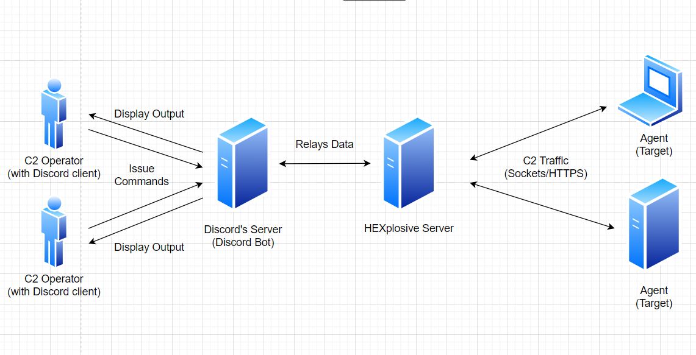

This C2 uses a push-style mechanism with Python sockets as the main communication channel, and HTTPS as an alternative communication channel for file transfers.
<br>
<br>

## Example Usage

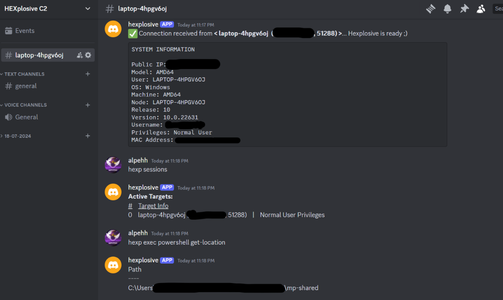

After receiving a connection from an agent, the server will create a Discord channel and display basic information (e.g. IP, Username, Privileges) of the compromised machine. From there, operators can issue commands and receive the output in that channel.
<br>
<br>

## Features

-   Execute native OS commands (e.g. cmd, PowerShell, bash)
-   Take screenshot of all monitors
-   Download files from target
-   Upload files to target
-   Take webcam photo
-   Steal browser credentials (Windows only, has support for only Chrome browser)
-   Dump Wi-Fi credentials (Windows only)
-   Screen recording
-   Voice recording
-   Keylogging
-   List system information of targets (e.g. IP, OS, privileges)
-   Capture clipboard content
-   Display CPU and memory usage
-   Check hash to identify tampering of agent
-   Analysis evasion
-   RSA encryption for socket data

This is the list of available commands that can be run:

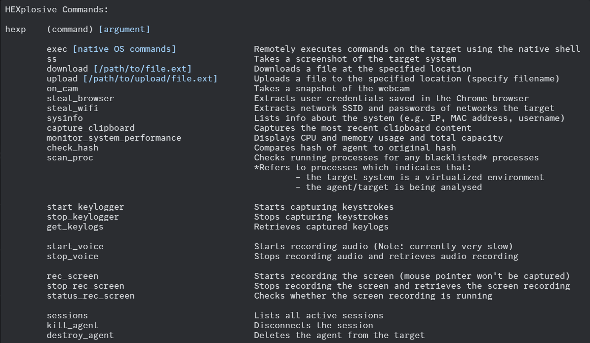
<br>
<br>

## Agent Flow Diagram (Windows agent)

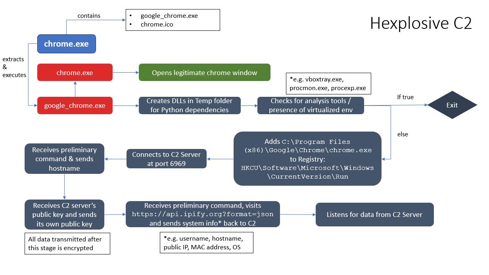
<br>
<br>

## Testing Against Antivirus Software

Most of the C2 functionalities have been tested against Windows Defender and Cortex XDR. The agent was able to evade detection by Windows defender (as of 6 September 2024).

However, some of the functionalities were detected by Cortex XDR:

| Functionality             | Detected? | Remarks                                                |
| ------------------------- | --------- | ------------------------------------------------------ |
| Execute OS commands       | Yes       | “Get-Process” PowerShell cmdlet triggered Cortex alert |
| Steal browser credentials | Yes       |                                                        |
| Screenshot                | No        |                                                        |
| Download                  | No        |                                                        |
| Upload                    | No        |                                                        |
| Turn on webcam            | No        |                                                        |
| Keylogger                 | No        |                                                        |
| Dump Wi-Fi credentials    | No        |                                                        |
| Screen recording          | No        |                                                        |
| Voice recording           | No        |                                                        |
| List system information   | No        |                                                        |
| Analysis evasion          | No        |                                                        |
| Capture clipboard         | N/A       | Not tested                                             |
| Display CPU/memory usage  | N/A       | Not tested                                             |

<br>
<br>

## Setup

### Agent Creation

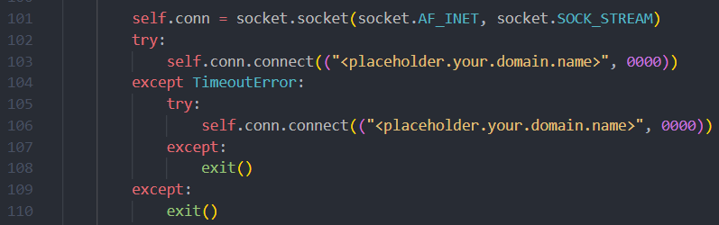

Before obfuscation, the first step is to replace all occurrences of “placeholder” (and the port number) with the respective information.

1.     After obfuscating the Python script, package it into an executable using PyInstaller or any similar tool

##### PyInstaller:

```
pyinstaller –-noconsole --onefile -–icon=”chrome.ico” hexplosive-agent.py
```

2.     Create a WinRAR SFX archive containing the exe agent and chrome icon

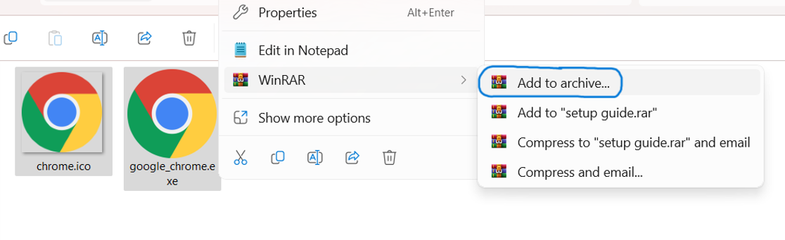

3.     Rename the archive name to “chrome.exe” with the following Archiving Options checked, then go to Advanced > SFX options…

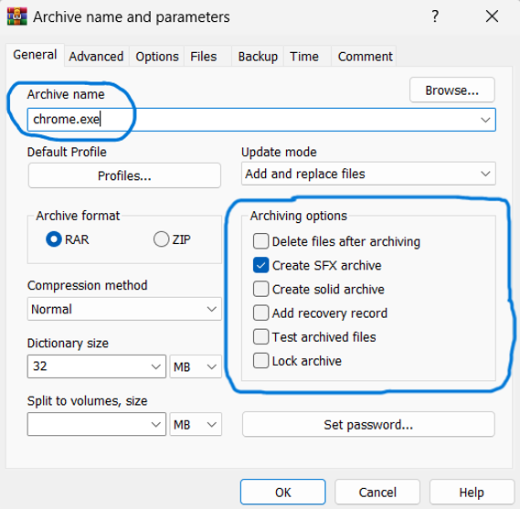 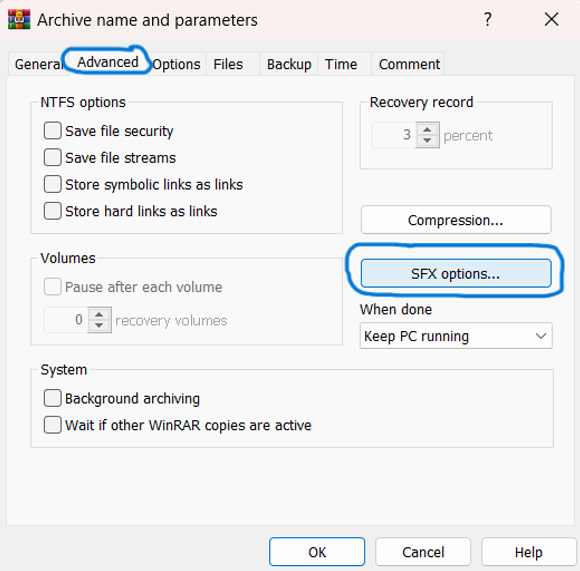

4.     In the “Update” tab, select the following options

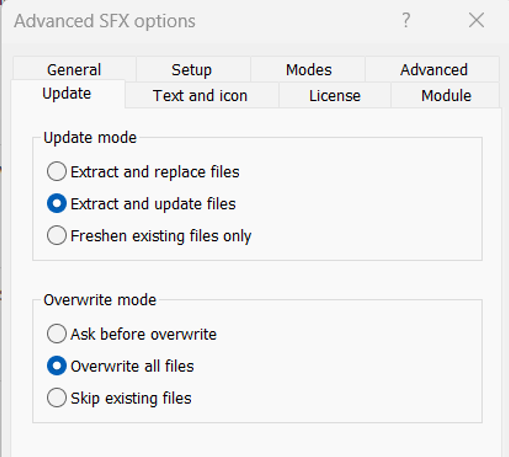

5.     In the “Text and icon” tab, load the chrome.ico file into the bottom option

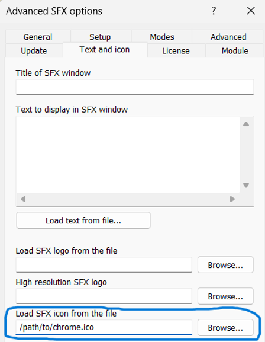

6.     Set the agent to be run after extraction

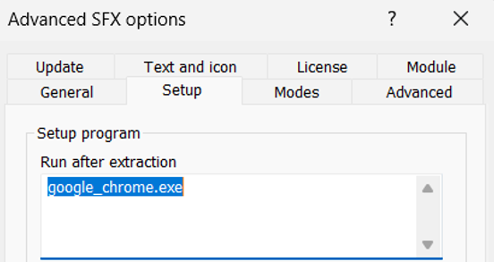

7.     In the “Modes” tab, enable “Unpack to temporary folder” and select “Hide all”

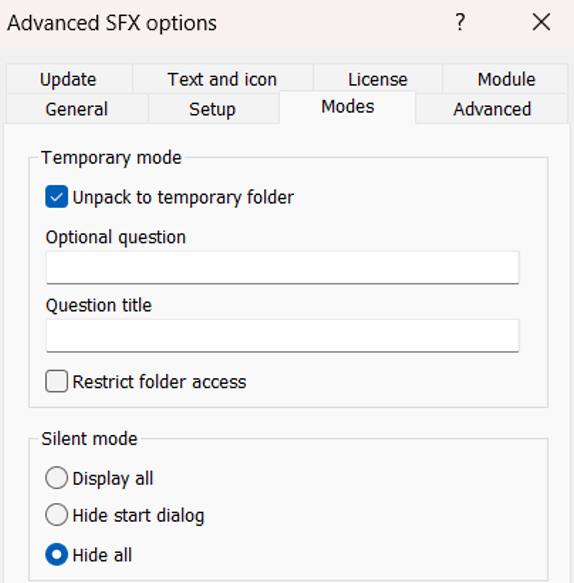

This hides the extraction dialog and ensures that the agent and chrome icon is extracted to the temp folder.

8.     Press OK > OK

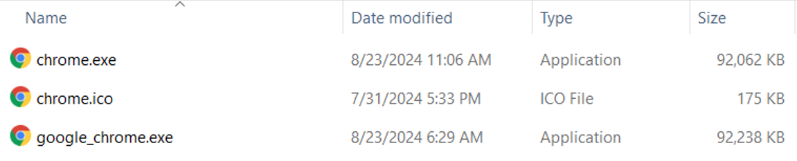

The chrome.exe SFX archive should then have been created. When it is double clicked, it will carry out [these actions](<#agent-flow-diagram-windows-agent>). The extracted files will be automatically deleted after the program has gracefully exited. However, a shutdown or restart will NOT delete the files, thus leaving residual artefacts.

### Server Setup

HEXplosive C2 also has HTTPS as a communication channel, so it uses Nginx as a reverse proxy to the Quart server running in the Python script. Thus, a domain name and SSL/TLS certificate is required.

_Note: The C2 Server should be a Linux system_

1.     Create and obtain:

    a.     Discord bot and obtain the bot’s token

    b.     Domain name (Dynu offers free domain names)

    c.     SSL/TLS certificate (a free option is Let’s Encrypt/certbot)

2.     Find and replace all instances of “placeholder” with the relevant info

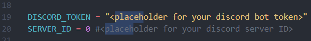

3.     If not already installed, install nginx and enable it on boot

```
apt-get install nginx

systemctl enable nginx
```

4.     Edit /etc/nginx/nginx.conf and increase the maximum request body size to a value greater than 25mb (Discord has a 25mb limit for files)

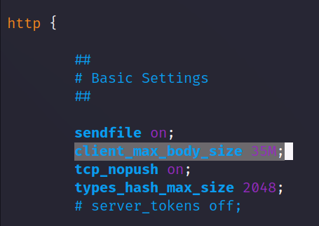

5.     Edit /etc/nginx/sites-available/default file

a.     In the server {} block, comment out the lines listening on port 80 and uncomment the ones on port 443. Then, add the certificate and private key:

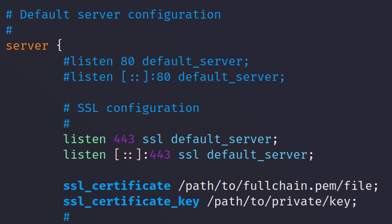

b.     In the same server {} block, change the “server_name” to your domain name and add these new blocks within:

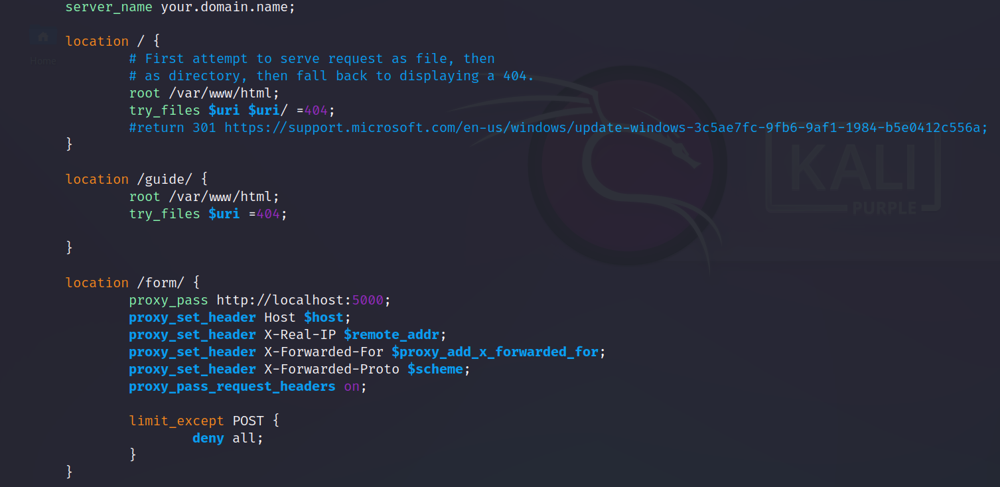

The “location /form/ {}” block will make Nginx work as a reverse proxy (for POST requests) to the Quart server running locally on port 5000.

c.     Finally, create a new server block to upgrade all HTTP to HTTPS requests

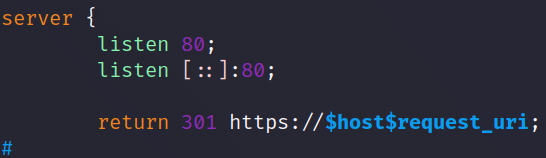

6.     Install required Python libraries

```
pip install discord

pip install pycryptodome

pip install quart
```

7.     Start the Nginx server and run the server script

```
systemctl start nginx

python3 hexplosive-server.py
```

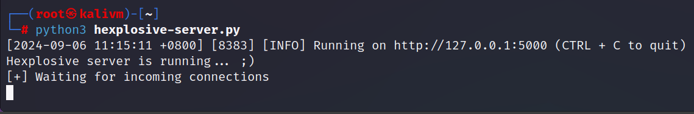
